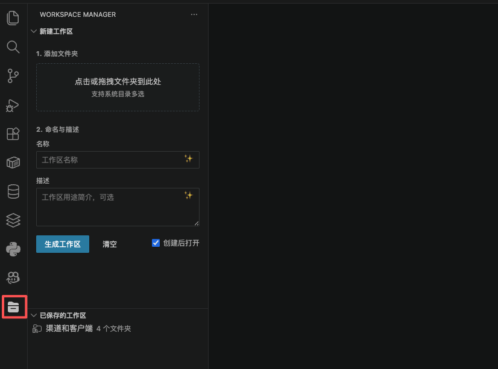

# Workspace Manager

VS Code 多根工作区管理插件 —— 用更顺手的方式新建、整理和打开 `.code-workspace`。

## 功能

- **🗂 拖拽生成**：把文件夹直接拖进侧边栏面板，一键生成 `.code-workspace`
- **📁 目录多选**：点击拖拽区可在系统文件选择器里一次性多选多个目录
- **📋 工作区记录**：所有创建过的工作区集中展示，单击即可打开，可重命名、改描述、删除
- **✨ AI 描述**：
  - 基于各项目当前 git 分支的最近提交，自动生成 Markdown 描述
  - 也可以读取该工作区下你与 GitHub Copilot 的会话主题，归纳出"这个工作区在做什么"
- **🪟 灵活打开**：点击工作区会弹出美化卡片，可选「当前窗口 / 新窗口」打开，并直接在卡片里编辑名称和描述
- **🌿 分支徽章**：列表中实时显示每个项目当前 git 分支与是否有未提交改动

## 截图

> 在这里放使用截图，建议至少 2-3 张：侧边栏面板、打开弹窗、AI 生成描述。



## 安装

### 方式一：VS Code 扩展市场（上架后可用）

在 VS Code 扩展面板搜索 **Workspace Manager** 并点击 Install。

或通过命令行：

```bash
code --install-extension duodian.vscode-workspace-manager
```

### 方式二：直接下载 VSIX 安装

1. 下载 [vscode-workspace-manager-0.1.0.vsix](https://github.com/TomHusky/vscode-workspace-manager/raw/main/vscode-workspace-manager-0.1.0.vsix)
2. 在 VS Code 中：扩展面板 → 右上角 `...` → **Install from VSIX...** → 选择下载的文件
3. 或通过命令行：

```bash
code --install-extension vscode-workspace-manager-0.1.0.vsix
```

## 使用

1. 在活动栏点击 Workspace Manager 图标
2. 在「新建工作区」面板拖入或点击选择若干文件夹
3. 点击 ✨ 让 AI 起名、写描述（可选；需已登录 GitHub Copilot）
4. 「生成工作区」会在 `~/CopilotWorkspaces/` 下保存 `.code-workspace` 文件
5. 在「已保存的工作区」列表中单击任意条目打开，或在卡片里编辑信息

## 配置

| 设置 | 默认 | 说明 |
| --- | --- | --- |
| `workspaceManager.storageDir` | `~/CopilotWorkspaces` | 保存 `.code-workspace` 的目录 |
| `workspaceManager.openBehavior` | `ask` | 打开方式：`ask` / `current` / `newWindow` |

## 关于 AI 与隐私

- AI 功能调用 VS Code 内置的 [Language Model API](https://code.visualstudio.com/api/extension-guides/language-model)，需要安装并登录 **GitHub Copilot Chat**；未登录时会自动回退到基于本地 git 记录的简单描述。
- 「按 Copilot 会话生成描述」会读取本机 VS Code 用户数据目录下与该工作区对应的 `chatSessions/*.jsonl`，仅在本地解析、不上传任何数据。
- 所有 `.code-workspace` 文件均保存在本地目录，不上传任何信息到第三方服务。

## 开发

```bash
git clone https://github.com/TomHusky/vscode-workspace-manager
cd vscode-workspace-manager
npm install
npm run compile
```

按 `F5` 启动扩展开发宿主进行调试。

## License

[MIT](./LICENSE)
